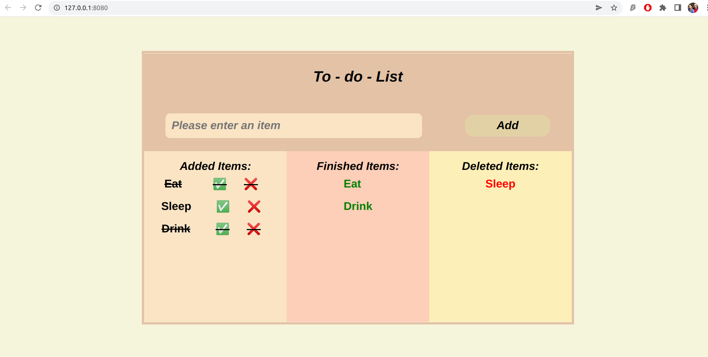

## To Do List using DOM

**[todolist app ](https://sgujuluva.github.io/to-do-list-DOM/)**

---

#### Navigation

- About Project
  - _Welcome to my To-Do List app. This website is designed to add the to do list. _
  - _Developed With Scss structure_

- Contact
  - _sanghee04@gmail.com_
  - _GitHub: sgujuluva_
 
- Used Tools
  - _Fonts : PT Sans, sans-serif
  - _Colors :light brown shades form Adobe Wheel color generator_

---

### About Project

My To-do-List website is designed with SCSS structure. 
First we need to add the add to do. Once done , check the Green tick button - the item will be moved to finished item . If you click X button, the item will be moved to deleted item.
### How to use this Project

Check my code in the given link and can see my website.

##### Developed With

- [x] _HTML5_
- [x] _CSS3_
- [x] _SASS_
- [x] _SCSS_
- [x] _JavaScript_
- [ ] _React_
- [ ] _Bootstrap_
- [x] _npm_

---

### Contact

Mail: <sanghee04@gmail.com> 
GitHub: [sgujuluva](https://github.com/) 

---

### Used Tools

- [npm](https://www.npmjs.com/)
- [Google Fonts](https://fonts.google.com/)
- [Visual Studio Code](https://code.visualstudio.com/)

---

Made with ❤️ by Sangeetha

